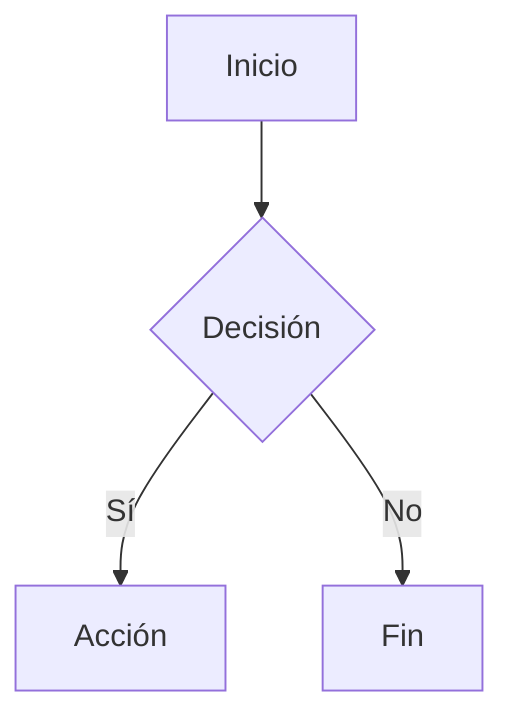

# Librerías locales opcionales

MarkLocal puede renderizar diagramas Mermaid si encuentra `mermaid.min.js` en esta carpeta. El archivo no se incluye en el repositorio porque pesa varios MB y se actualiza con cierta frecuencia.

## Instalar Mermaid

1. Descarga la última versión de [`mermaid.min.js`](https://cdn.jsdelivr.net/npm/mermaid/dist/mermaid.min.js) (clic derecho → Guardar como…).
2. Guárdala como `Assets/lib/mermaid.min.js` dentro de la carpeta de instalación de MarkLocal (o, si trabajas con el repo, dentro de `MarkLocal/Assets/lib/`).
3. Reinicia MarkLocal. Los bloques de código `mermaid` se renderizarán como diagramas en la previsualización y al exportar a HTML/PDF.

Ejemplo:

````markdown

````

## Quitar Mermaid

Borra `mermaid.min.js` de esta carpeta. Los bloques `mermaid` volverán a aparecer como código normal.

## Otras librerías

- **MathJax**: aún no integrado. En el futuro se podrá colocar aquí `mathjax/es5/tex-mml-chtml.js` y se inyectará automáticamente.
